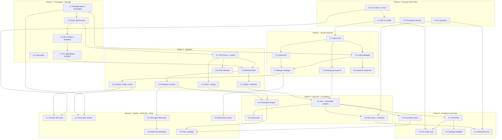

# SentinelNet — Gap Analysis & Implementation Roadmap

> Principal-engineer review cross-referencing the current state report (commit `6fcb9039`) against the *Complete Observability & Refactoring Implementation Guide* (v1.0). The guide introduces a **Day-2 flow-observability capability that does not exist today at all** and folds it into a refactoring effort the state report *had already planned but not started*.

---

## 1. Gap Analysis

### 1.1 Feature-by-feature cross-reference

| Area (from guide) | Status today | Evidence from state report |
|---|---|---|
| **SQLite observability schema** (`flow_aggregates`, `syslog_events`, `correlated_events`) | **Missing** (adjacent primitive exists) | Storage is JSON/CSV: `network_hosts.csv`, `detected_versions.json`, `groups.json`, `users.json`. The report explicitly lists "Migrazione dello storage… verso un datastore transazionale (SQLite/DB)… (già presente `init_db`)" as a **future** Phase-2 item. So SQLite is *planned*, an `init_db` stub may exist, but **no observability tables exist**. |
| **`routers/fortigate.py` + `wlc.py` extraction** | **Missing (services exist, routers don't)** | `fortigate_service.py` and `wlc_service.py` exist as service modules, and endpoints (`fgt_arp`, `wlc_ap_summary`, …) exist — but **inside `app_server.py`** ("app_server.py concentra ~51 endpoint eterogenei"). The router split is listed as a **recommended-not-done** medium item: "Refactoring di `app_server.py` in `APIRouter` per dominio". |
| **Observability router `/top` + `/anomalies`** | **Missing** | No flow/talker/anomaly concept anywhere in the report. Observability today = triage + topology + MAC/ARP, not traffic flows. |
| **Async UDP listeners (IPFIX / sFlow / Syslog)** | **Missing** | No flow-export ingestion anywhere. Current ingress is SSH/REST poll + WebSocket terminal + agent HTTP polling. No UDP listeners, no NetFlow/IPFIX/sFlow/syslog receiver. |
| **Lifespan manager in `app_server.py`** | **Unknown / likely legacy `on_event`** | Report confirms FastAPI + Uvicorn but does not state startup mechanism. Guide's `@asynccontextmanager lifespan` is a net addition; must verify whether current code uses `@app.on_event("startup")`. |
| **Frontend "Live Flows" tab** | **Missing** | UI is a single-page `templates/dashboard.html` with inventory/topology/terminal/threat/MCP tabs. No flows tab. Vis.js is present (topology), so `highlightInTopology()` has a real target. |
| **Docker UDP ports (4739/6343/514)** | **Missing** | Current Docker exposes only the management app (`8765`), volume `./data:/app/data`. No UDP port mappings. |
| **Testing (ingestion, routers, obs API)** | **Partially (framework exists, no coverage for new code)** | Strong existing suite (`test_fortigate_service`, `test_wlc_service`, `test_sites`, …) but nothing for flows/UDP/SQLite. Report itself flags "Ampliamento copertura test sulle community a bassa coesione". |

### 1.2 State-report debt folded in

| Debt item | Guide coverage | Verdict |
|---|---|---|
| **H-1 — no built-in TLS** | Guide *worsens* posture: adds three cleartext UDP ingest ports bound to `0.0.0.0` and never re-raises TLS. | **Unaddressed & aggravated.** Must be Phase 0. |
| **I-1 — AI context sends full config to third-party LLM** | Guide adds `analyzeFlow()` → AI, feeding *more* data (flows) to the assistant, still unredacted. | **Unaddressed & expanded surface.** |
| **I-2 — provisioner secrets in cleartext** | Not touched. | **Unaddressed.** |
| **L-1 — JWT in `sessionStorage`** | Guide's frontend JS reads `sessionStorage.getItem('jwt_token')` and sends `Authorization: Bearer` — **directly contradicts** the report's own recommendation to move to `HttpOnly`/`Secure` cookies. | **Regressed / entrenched.** |
| **`app_server.py` god node (cohesion 0.04, ~51 endpoints)** | Guide provides a concrete router-split + DI pattern + migration table. This is the strongest, most aligned part of the guide. | **Directly addressed (good).** |
| **JSON/CSV → SQLite migration** | Guide adds a *parallel* SQLite DB (`observability.db`) but leaves inventory/users/groups on JSON/CSV. Doesn't advance the core migration; introduces a second storage paradigm. | **Partially aligned; risk of storage sprawl.** |
| **Multi-site hardening (queue observability, retry, agent token)** | Not touched. Flow ingestion is central-only in the guide — no site-agent path for remote-site flows. | **Unaddressed; new blind spot for Mode B sites.** |

### 1.3 Correctness / design defects in the guide (must fix before adoption)

These are blocking-quality issues a principal engineer should not merge as-is:

1. **Blocking DB calls inside async handlers.** `handle_ipfix_flow`/`handle_syslog_message` use synchronous `sqlite3` + `conn.commit()` directly in the asyncio event loop, and `datagram_received` spawns an unbounded `asyncio.create_task` per packet. Under real flow volume (thousands of pps) this **stalls the entire Uvicorn loop** (terminal WebSocket, API, everything). Needs a bounded async queue + dedicated writer thread/executor + batched commits.
2. **RBAC scope mismatch.** Guide assumes a single `user.group` (`WHERE tenant = user.group`). The report's model is **multi-group scope** (`user_group_scope`, `assert_group_allowed`) — a user may see several groups. Using a scalar `user.group` will silently hide or leak data. Must query `WHERE tenant IN (:scoped_groups)`.
3. **No real aggregation.** Table is named `flow_aggregates` with a `UNIQUE(window_start, …)` rollup key, but the handler does a plain `INSERT` with no `ON CONFLICT … DO UPDATE`. "Minute rollup" is claimed but not implemented → the table will grow at raw-flow rate and violate its own UNIQUE constraint.
4. **Hard-coded `tenant="default"` at ingestion.** UDP packets have no auth and no `device_ip → group/tenant` mapping. Every flow lands in `default`, so tenant scoping is defeated at the source. Need exporter-IP → device → group resolution (`get_device_by_ip`).
5. **Syslog on privileged port 514** requires root / `CAP_NET_BIND_SERVICE`; conflicts with least-privilege and with PyInstaller/desktop deployment. Recommend high port (5514) + optional privileged mapping in Docker only.
6. **Import path mismatch.** Guide uses a `sentinelnet.` package namespace (`from sentinelnet.fortigate_service import …`), but the current codebase appears **flat** (`app_server.py`, `core_engine.py`, `fortigate_service.py` at root). Every import in the guide will fail unless we first introduce a package, or the imports are rewritten flat.
7. **Language inconsistency.** Codebase is **Italian**; all new code/comments/UI strings in the guide are English. Decide a policy (recommend: Italian UI strings + English identifiers, matching existing style) to avoid a bilingual mess.
8. **Unauthenticated ingest = spoofable data.** Any host reaching the UDP ports can inject fake flows/syslog into a tenant. Combined with the AI `analyzeFlow` path, this is a **data-integrity + prompt-injection vector**.
9. **`correlated_events` is orphaned.** Schema + `/anomalies` API exist, but **nothing populates the table** — no correlation/stitching engine is provided. The feature is a dead end without it.

**Bottom line:** the *refactoring* portion of the guide is sound and matches existing debt. The *observability* portion is a genuinely new capability but ships with event-loop-blocking, RBAC-bypassing, security-regressing defects that must be corrected before merge.

---

## 2. Implementation Plan (Phased Roadmap)

Global constraints: Python 3.11+, **uv**, FastAPI + Uvicorn, Netmiko; ships as **PyInstaller exe** *and* **Docker**; **Italian** codebase. Every phase must keep both artifacts buildable and the existing test suite green.

Effort key: **S** ≈ ≤2 days · **M** ≈ 3–8 days · **L** ≈ 2–4 weeks.

---

### Phase 0 — Security quick wins (do first, independent of observability)

**Goals:** close/mitigate the report's own findings *before* adding new attack surface (UDP ingest).

| # | Work item | Files | Dep | Effort | Risk |
|---|---|---|---|---|---|
| 0.1 | TLS story: native ASGI TLS option (`--ssl-certfile/keyfile` via env) **and** hardened reverse-proxy guide | `app_server.py`, `data_config.py`, `docs/HARDENING.md`, `docker-compose.yml` | — | M | Cert lifecycle on desktop/exe |
| 0.2 | Move JWT to `HttpOnly`/`Secure`/`SameSite` cookie; retire `sessionStorage` | `security_manager.py`, `templates/dashboard.html` (fetch/WS auth) | 0.1 (Secure needs TLS) | M | WebSocket + CSRF handling; breaks any external API client using Bearer |
| 0.3 | AI-context secret redaction (masking pass on config/flows before LLM) | `ai_assistant.py`, new `redaction.py` | — | M | Over/under-redaction; false confidence |
| 0.4 | Provisioner secret handling (placeholders / vault refs, no cleartext in generated day-0) | `switch_provisioner.py`, `fortigate_provisioner.py`, `crypto_vault.py` | — | S/M | Backward compat of generated configs |

**Acceptance:** H-1 documented+optional-native TLS; L-1 closed (no token in `sessionStorage`, cookie flows work incl. WS terminal); I-1 configs/flows sent to LLM are masked with a test asserting no secret leaks; I-2 generated configs contain no cleartext secrets. All existing tests pass on both exe and Docker builds.

---

### Phase 1 — Packaging & storage foundation

**Goals:** resolve the import-path mismatch, introduce a real transactional store, keep JSON/CSV working during transition.

| # | Work item | Files | Dep | Effort | Risk |
|---|---|---|---|---|---|
| 1.1 | Decide & apply package layout (flat vs `sentinelnet/` package); fix PyInstaller spec + entrypoint accordingly | `pyproject.toml`, `*.spec`, all module headers | — | M | PyInstaller path resolution (`get_path`) regressions |
| 1.2 | Async-safe SQLite layer: single WAL connection pool + executor/queue writer; `get_observability_connection` **must not** be called ad-hoc in async paths | `data_config.py`, new `db.py` | 1.1 | M | Concurrency bugs; WAL on network volumes |
| 1.3 | Observability schema + idempotent migration (`schema.sql`, versioned) | `observability/storage/schema.sql`, `db.py` | 1.2 | S | Schema drift |
| 1.4 | **Fix aggregation semantics**: `INSERT … ON CONFLICT(window_start,…) DO UPDATE SET total_bytes=total_bytes+excluded…` | `observability/storage/*` | 1.3 | S | Correct minute bucketing (truncate ts to 60s) |
| 1.5 | Language/style policy doc (Italian strings, English identifiers) | `CONTRIBUTING.md` | — | S | — |

**Acceptance:** app builds/runs as exe *and* Docker after packaging change; `observability.db` created via migration under `SENTINELNET_DATA_DIR`; concurrent writes don't block the event loop (load test with N async writers); aggregation UPSERT verified by test (two flows same bucket → summed, one row).

---

### Phase 2 — `app_server.py` refactor into routers (aligned with report debt)

**Goals:** raise cohesion, adopt DI auth, prove the pattern on FortiGate + WLC first.

| # | Work item | Files | Dep | Effort | Risk |
|---|---|---|---|---|---|
| 2.1 | Auth as FastAPI dependencies: `require_operator`/`require_admin`/`get_current_user` returning scoped `User` (multi-group) | `security_manager.py`, `user_manager.py` | 0.2 | M | Must preserve audit log, rate-limit, lockout, CLI blacklist behavior currently in middleware |
| 2.2 | Extract `routers/fortigate.py` (arp/inventory/config/diagnose/dhcp) | `routers/fortigate.py`, `app_server.py` | 2.1 | M | Route path parity (`/api/…`), behavior drift |
| 2.3 | Extract `routers/wlc.py` | `routers/wlc.py`, `app_server.py` | 2.1 | M | Same |
| 2.4 | Replace `on_event` with `lifespan` context manager; `include_router` there | `app_server.py` | 2.2, 2.3 | S | Startup ordering; test client compatibility |
| 2.5 | **Correct scope dependency**: device-scope check uses `assert_group_allowed`/`user_group_scope`, not scalar `user.group` | routers/* | 2.1 | S | RBAC leak if wrong |
| 2.6 | Migration table + checklist; snapshot test of OpenAPI (`/docs`) before/after | `docs/REFACTOR.md`, `tests/test_router_parity.py` | 2.2–2.4 | S | — |

**Acceptance:** FortiGate + WLC endpoints served from routers with identical paths/responses (contract test green); auth/audit/rate-limit/blacklist all still enforced; `app_server.py` endpoint count drops measurably; `/docs` renders; both build artifacts OK.

---

### Phase 3 — Flow/event ingestion (the hard, new capability)

**Goals:** ingest IPFIX/sFlow/syslog safely, with real tenant attribution and no loop blocking.

| # | Work item | Files | Dep | Effort | Risk |
|---|---|---|---|---|---|
| 3.1 | Async UDP server factory + bounded ingest queue (backpressure, drop-with-metric) | `observability/ingesters/udp_server.py` | 1.2 | M | Loop starvation, memory growth |
| 3.2 | Dedicated writer worker (executor thread) with **batched** commits | `observability/ingesters/writer.py` | 3.1, 1.4 | M | Batch loss on crash |
| 3.3 | Real IPFIX/NetFlow decoder (template handling) — replace mock | `observability/ingesters/ipfix.py` | 3.1 | L | IPFIX template state, vendor quirks |
| 3.4 | sFlow + syslog parsers (severity/action normalization for FortiGate/Palo Alto) | `observability/ingesters/{sflow,syslog}.py` | 3.1 | M | Format variance |
| 3.5 | **Exporter-IP → device → tenant mapping** at ingest (drop/park unknown exporters) | `observability/ingesters/*`, `inventory_manager.py` | 3.2 | M | Misattribution / leakage |
| 3.6 | Listener config: **high port defaults (4739/6343/5514)**, bind `127.0.0.1` by default, opt-in `0.0.0.0`; env-gated so exe/desktop can disable entirely | `app_server.py` lifespan, `data_config.py` | 2.4, 3.1 | S | Privileged 514 only inside Docker |
| 3.7 | Minute rollup job (async periodic) verifying UPSERT + retention/pruning | `observability/rollup.py` | 3.2, 1.4 | M | Retention wiping live data |

**Acceptance:** synthetic IPFIX/sFlow/syslog fixtures ingested → correct rows with correct tenant; sustained load test (e.g. 5k pps) shows event loop latency unaffected (terminal WS + API stay responsive); unknown exporter is dropped/quarantined with audit entry; retention job prunes beyond window.

---

### Phase 4 — Observability API + correlation engine

**Goals:** serve scoped queries and actually populate `correlated_events`.

| # | Work item | Files | Dep | Effort | Risk |
|---|---|---|---|---|---|
| 4.1 | `routers/observability.py` `/top` + `/anomalies`, **multi-tenant scoped** (`IN (:groups)`), parameterized | `routers/observability.py` | 2.5, 3.7 | M | SQL perf on large tables |
| 4.2 | Correlation/stitching engine: flow × syslog × MAC-history → `correlated_events` (enrich `switch_port` via `mac_history`) | `observability/correlator.py` | 3.4, 3.5 | L | False positives; join cost |
| 4.3 | Query performance pass (indexes from schema, `EXPLAIN QUERY PLAN`, subquery in `/top` rewrite) | `observability/storage/*` | 4.1 | S | — |
| 4.4 | MCP tool + AI redaction hook: expose `get_top_talkers`/`get_anomalies` as read-only MCP tools with same scope | `mcp_server.py`, `ai_assistant.py` | 4.1, 0.3 | M | Over-exposure to LLM (I-1) |

**Acceptance:** `/top` and `/anomalies` return only in-scope tenants (RBAC test with multi-group user); correlated events generated from a scripted "malware-blocked + matching flow" fixture with enriched switch port; MCP tools honor viewer/operator roles and pass through redaction.

---

### Phase 5 — Frontend "Live Flows" tab

**Goals:** wire the UI into existing Vis.js + tab system, using the Phase-0 cookie auth (no `sessionStorage`).

| # | Work item | Files | Dep | Effort | Risk |
|---|---|---|---|---|---|
| 5.1 | "Live Flows" tab HTML + table/bars; Italian UI strings | `templates/dashboard.html` | 4.1 | S | — |
| 5.2 | JS `loadTopTalkers`/auto-refresh using **cookie auth** (`credentials:'include'`), not Bearer/`sessionStorage` | `templates/dashboard.html` | 0.2, 5.1 | S | Regressing L-1 if copied verbatim |
| 5.3 | `highlightInTopology()` against real Vis.js `window.network` node model | `templates/dashboard.html` | 5.1 | S | Node id/label mapping in existing map |
| 5.4 | `analyzeFlow()` → AI tab, routed through redaction (I-1) | `templates/dashboard.html`, `ai_assistant.py` | 0.3, 4.4 | S | Sending flows to third-party LLM |
| 5.5 | Anomalies panel bound to `/anomalies` with ack/resolve actions | `templates/dashboard.html`, `routers/observability.py` | 4.1 | M | State transitions |

**Acceptance:** tab loads scoped flows, auto-refresh pauses when tab hidden, IP click focuses topology node, AI button uses redacted context; no token in `sessionStorage` (audited in code review + test).

---

### Phase 6 — Deployment, multi-site & test hardening

| # | Work item | Files | Dep | Effort | Risk |
|---|---|---|---|---|---|
| 6.1 | Docker: expose UDP `4739/6343` + `5514`, doc privileged 514; keep listeners opt-in via env | `docker-compose.yml`, `docs/HARDENING.md` | 3.6 | S | Firewall/attack surface |
| 6.2 | PyInstaller: ensure new package + `schema.sql` bundled; desktop default = listeners **off** | `*.spec`, `data_config.py` | 1.1, 3.6 | M | Missing bundled resource |
| 6.3 | **Site-agent flow relay** (Mode B): remote-site collectors forward flows over authenticated agent channel instead of exposing central UDP to VPN | `site_agent.py`, `site_manager.py`, ingesters | 3.5 | L | Multi-site auth/queue hardening (open debt) |
| 6.4 | Multi-site hardening: job-queue observability, retries, agent token rotation | `site_manager.py`, `site_agent.py` | 6.3 | M | — |
| 6.5 | Test coverage: ingesters, routers, obs API, correlator, RBAC scoping; load/soak test | `tests/test_observability_*`, `tests/test_router_parity.py` | all | M | — |
| 6.6 | Complete remaining router extraction (mac, ai, sites, backup) | `routers/*.py` | 2.* | M | Incremental parity |

**Acceptance:** Docker exposes UDP with documented risk; exe builds with listeners off by default; remote-site flows arrive via authenticated agent (no raw UDP over VPN); coverage added for all new modules incl. multi-group RBAC; soak test 24h without loop stalls or unbounded memory.

---

### Cross-cutting principles

- **Language:** Italian for user-facing strings/logs, English identifiers — matching existing style.
- **Dual-artifact gate:** every PR must build the PyInstaller exe *and* Docker image; listeners default **off** in exe/desktop.
- **No new plaintext channels before Phase 0** ships TLS + cookie auth.
- **Never** call `get_observability_connection()` synchronously in an async endpoint/handler after Phase 1 — go through the async DB layer.

---

## 3. Mermaid Roadmap Graph

